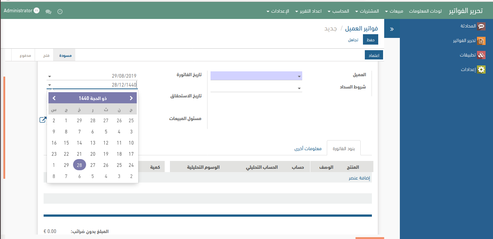

# Odoo Hijri Datepicker
Hijri Calendar datepicker add-on for Odoo ERP (version 11)

This is a repost of part of the work I've involved in @ [KACST SERP ERP project](https://github.com/SerpERP/SerpERP). (Please refer to original poster/project for issues or pull requests). This is an upgrade from an original contributer. You can find the original source code in "original implementation" folder.

## Description:
- Umm Al Qura(Hijri) Datepicker, consistent with original odoo datepicker style (theme-able).
- On-the-fly conversions between georgian and ummalqura calendars for datepicker and date fields.
- This plugin overrides some default configuration for georgian odoo datepicker. Specifically, it override min/max dates and turning off showing the week number, to be consistent with hijri.
- This plugin overrides arabic locale files for georgian calendars, to support only arabic-english numerical system (not arabic-hindi) if you want to cancel this override, you may comment all the code under controllers folder.
- **IMPORTANT** There are limitations on the supported date-time formats. however, formats like (dd/mm/yyyy, mm/dd/yyyy) are supported.
- Please see  ./static for the included open source codes and libraries.
- Currently only supports arabic and english languages.

## Screenshots

